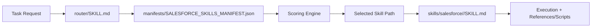

# SF Skill Hub

<p align="center">
  <a href="./router/SKILL.md"></a>
  <a href="./manifests/SALESFORCE_SKILLS_MANIFEST.json"></a>
  <a href="./skills/salesforce"></a>
</p>

Salesforce skill routing platform for AI coding agents, designed for deterministic skill selection and production-oriented execution.

## Overview
This repository provides a single-router pattern for Salesforce work across metadata, Apex, Flow, Agentforce, deployment, testing, and operations.

Primary goals:
- deterministic routing from one tagged skill file
- low-friction integration for Codex/Claude-style agent workflows
- machine-readable routing contracts (`JSON` + `YAML`)
- maintainable skill inventory with predictable pathing

## Quick Start
1. Tag [`./router/SKILL.md`](./router/SKILL.md) in your AI runtime.
2. Provide task requirements normally.
3. Router resolves the best specialized skill via manifest scoring and executes that skill workflow.

## Routing Architecture


## Deterministic Selection Model
Routing is policy-driven from manifest metadata:
- exact name/domain match
- alias overlap
- category alignment
- avoid penalties
- tie-breakers for close scores

Manifest policy lives in:
- [`./manifests/SALESFORCE_SKILLS_MANIFEST.json`](./manifests/SALESFORCE_SKILLS_MANIFEST.json)
- [`./manifests/ROUTER_PROMPT.md`](./manifests/ROUTER_PROMPT.md)

## Repository Layout
```text
.
├─ router/
│  └─ SKILL.md
├─ manifests/
│  ├─ SALESFORCE_SKILLS_MANIFEST.json
│  ├─ SALESFORCE_SKILLS_MANIFEST.yaml
│  ├─ SALESFORCE_SKILLS_MANIFEST.md
│  └─ ROUTER_PROMPT.md
└─ skills/
   └─ salesforce/
      └─ <72 skill folders>
```

## Core Paths
- Router entrypoint: [`./router/SKILL.md`](./router/SKILL.md)
- Machine source of truth: [`./manifests/SALESFORCE_SKILLS_MANIFEST.json`](./manifests/SALESFORCE_SKILLS_MANIFEST.json)
- Skill inventory root: [`./skills/salesforce`](./skills/salesforce)

## Operational Usage
For auditable routing, request these outputs from the agent:
- selected skill path
- routing rationale
- confidence level
- execution summary

Expected output contract:
```text
selected_skill: ./skills/salesforce/<skill-name>
reason: <brief routing rationale>
confidence: high|medium|low
execution_summary: <changes, validations, next actions>
```

## Change Management
When adding or modifying skills:
1. Update skill directories in `./skills/salesforce/...`.
2. Regenerate manifest JSON.
3. Regenerate YAML and markdown mirrors.
4. Verify router path references remain valid.
5. Commit manifest + router changes together.

## Governance Recommendations
- Treat manifest JSON as versioned API contract.
- Use PR checks to detect stale manifest vs filesystem state.
- Require routing rationale in CI logs for high-risk deployment tasks.
- Keep fallback behavior explicit and conservative.

## Source Repositories
This hub was assembled from:
- Official: [forcedotcom/afv-library](https://github.com/forcedotcom/afv-library)
- Community: [Jaganpro/sf-skills](https://github.com/Jaganpro/sf-skills)
- Community Claude variant: [Jaganpro/claude-code-sfskills](https://github.com/Jaganpro/claude-code-sfskills)

Deduplication notes:
- duplicate folders removed by name and content-hash checks
- manifests generated from final deduplicated skill set

## Suggested GitHub Topics
`salesforce`, `agentforce`, `apex`, `flow`, `metadata-api`, `ai-agents`, `llm-routing`, `automation`

## License
Use repository license and upstream licenses where applicable.
